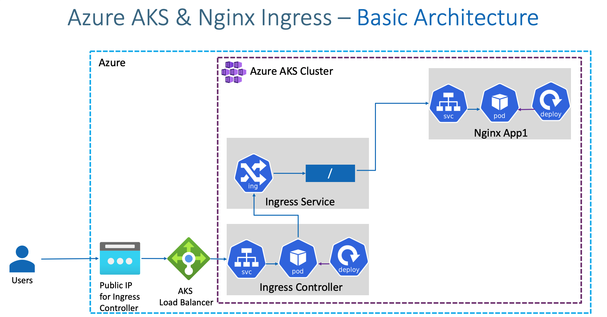

# Ingress - Basics

## Introduction

### Ingress Basic Architecture


### What are we going to learn?
- We are going to create a **Static Public IP** for Ingress in Azure AKS
- Associate that Public IP to **Ingress Controller** during installation.
- We are going to create a namespace `ingress-basic` for Ingress Controller where all ingress controller related things will be placed.
- Create / Review Ingress Manifest
- Deploy a simple Nginx App1 with Ingress manifest and test it
- Clean-Up or delete application after testing

## Create Static Public IP
```
# Get the resource group name of the AKS cluster
az aks show --resource-group aks-rg1 --name aksdemo1 --query nodeResourceGroup -o tsv
```
```
# REPLACE - Create Public IP: Replace Resource Group value
az network public-ip create --resource-group MC_aks-rg1_aksdemo1_centralus --name myAKSPublicIPForIngress --sku Basic --allocation-method static --query publicIp.ipAddress -o tsv
```
- Make a note of Static IP which we will use in next step when installing Ingress Controller
```
# Make a note of Public IP created for Ingress
#52.154.156.139
```

## Install Ingress Controller
```
# Install Helm3 (if not installed)
curl -fsSL -o get_helm.sh https://raw.githubusercontent.com/helm/helm/main/scripts/get-helm-3
chmod 700 get_helm.sh
./get_helm.sh
```

```
# Create a namespace for your ingress resources
kubectl create namespace ingress-basic
```
```
# Add the official stable repository
helm repo add ingress-nginx https://kubernetes.github.io/ingress-nginx
```
```
helm repo add stable https://kubernetes-charts.storage.googleapis.com/
```
```
helm repo update
```

```
helm uninstall ingress-nginx  --namespace ingress-basic
```

```
# Replace Static IP
helm install ingress-nginx ingress-nginx/ingress-nginx \
    --namespace ingress-basic \
    --set controller.replicaCount=2 \
    --set controller.nodeSelector."beta\.kubernetes\.io/os"=linux \
    --set defaultBackend.nodeSelector."beta\.kubernetes\.io/os"=linux \
    --set controller.service.externalTrafficPolicy=Local \
    --set controller.service.loadBalancerIP="23.101.152.46"
```

```
# List Services with labels
kubectl get service -l app.kubernetes.io/name=ingress-nginx --namespace ingress-basic
kubectl describe service -l app.kubernetes.io/name=ingress-nginx --namespace ingress-basic
```
```
# List Pods
kubectl get pods -n ingress-basic
```
```
kubectl get all -n ingress-basic
```
```
# Access Public IP
curl http://<Public-IP-created-for-Ingress>
# Output should be
# 404 Not Found from Nginx
```
- Verify Load Balancer on Azure Mgmt Console
  - Primarily refer Settings -> Frontend IP Configuration

## Review Application k8s manifests
- 01-NginxApp1-Deployment.yml
- 02-NginxApp1-ClusterIP-Service.yml
- 03-Ingress-Basic.yml

## Deploy Application k8s manifests and verify
```
# Deploy
kubectl apply -f kube-manifests/
```
```
# List Pods
kubectl get pods
```
```
# List Services
kubectl get svc
```
```
# List Ingress
kubectl get ingress
```
```
# Access Application
curl http://<Public-IP-created-for-Ingress>/app1/index.html
```
```
curl http://<Public-IP-created-for-Ingress>
```
```
# Verify Ingress Controller Logs
kubectl get pods -n ingress-basic
```
```
kubectl logs -f <pod-name> -n ingress-basic
```

## Clean-Up Apps
```
# Delete Apps
kubectl delete -f kube-manifests/
```
